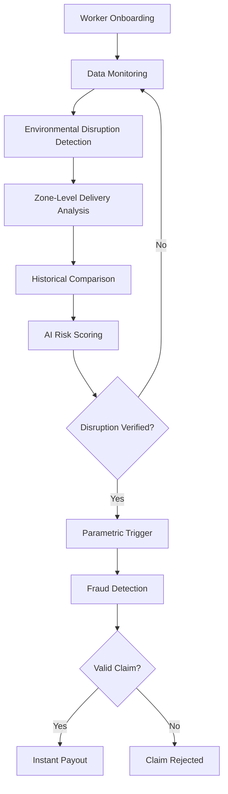

# Carely  
### *“An Insurance that truly cares”*  
> A Insurance Solution for Gig workers in guidance of Guidewire

---
## Institution Name  
Sri Eshwar College of Engineering  

---
## Team Details  
- **Team Name:** AG6  
- **Team Leader:** Reegan Ferdinand  

### Team Members  
- Suryaprakash S  
- Srivarshan R  
- Tamilselvan P
  
---
## 📋 Table of Contents
- [Overview](#-overview)
- [Problem](#-problem)
- [Our Solution](#-our-solution)
- [Key Features](#-key-features)
- [System workflow](#-System-workflow)
- [Data Sources](#-Data-Sources)
- [Competitive Advantage](#-Competitive-Advantage)
- [Expected Impact](#-Expected-Impact)

---
##  Overview

Imagine a delivery partner starting their day.

They log in, ready to earn.

But suddenly:
- 🌧️ Heavy rain starts  
- 🔥 Extreme heat slows movement  
- 📱 App goes down  
- 🚦 Traffic blocks deliveries  

At the end of the day — **less work, less income.**

👉 Not their fault.  
👉 No safety net.

**Carely exists to solve this.**

---
## Problem

Gig workers:
- ❌ Don’t have stable income  
- ❌ Don’t have insurance for income loss  
- ❌ Are affected by real-world disruptions daily  

Even one bad day can mean:
> 💸 Loss of essential daily earnings  

There is **no system today that protects their income in real-time.**

---
## 💡 Our Solution

**Carely** is a **parametric insurance platform** designed for gig workers.
It:

✅ Monitors real-world conditions
✅ Detects disruptions automatically
✅ Verifies income impact
✅ Instantly provides payouts

No paperwork.  
No claims process.  
Just **automatic support when needed.**

---
## 🔑 Key Features

### 1. 🤖 AI-Powered Risk Assessment
An AI model evaluates environmental and operational factors to calculate a **disruption risk score**.

**Input Factors:**
- Temperature
- Rainfall
- Air Quality Index (AQI)
- Traffic congestion
- Delivery demand
- Platform availability

**Output:**
- Disruption risk score (0-1)
- Risk category: `LOW` | `MEDIUM` | `HIGH`

**Used For:**
- Weekly premium pricing
- Disruption alerts
- Insurance trigger eligibility

---

### 2. 📍 Zone-Adaptive Disruption Thresholds
Environmental conditions vary significantly between cities and zones. Carely uses **historical zone data** to determine dynamic disruption thresholds.

**Example Thresholds:**

| Zone | Factor | Threshold |
|------|--------|-----------|
| Urban metro zone | Traffic index | 0.90 |
| Small city zone | Traffic index | 0.65 |
| Coastal zone | Rainfall | 120 mm |
| Dry region | Rainfall | 40 mm |

> 💡 Thresholds are dynamically adjusted based on historical disruption patterns and delivery activity data.

---
### 3. ✅ Context-Aware Parametric Trigger System
Traditional parametric insurance can trigger false payouts. Carely uses **two-layer verification**:

#### **Layer 1: Environmental Trigger** 🌍

```python
temperature > zone_threshold
rainfall > zone_threshold
AQI > zone_threshold
traffic_index > zone_threshold
platform_status == "down"
```

#### **Layer 2: Delivery Activity Validation** 📦

Even if conditions are extreme, the system verifies whether delivery activity actually dropped.
**Metrics Analyzed:**
- Deliveries per hour
- Active delivery partners
- Order demand
- Acceptance rate

✅ **Disruption confirmed** only if delivery activity decreases significantly compared to historical data.

---
### 4. 🔒 Intelligent Fraud Detection
Multiple verification layers prevent fraudulent claims:

| Check | Purpose |
|-------|---------|
| Weather data verification | Confirm disruption occurred |
| GPS location validation | Confirm worker location |
| Platform activity analysis | Detect fake inactivity |
| Duplicate claim detection | Prevent multiple claims |

**Example Rule:**
```
IF claim_reason == "rain"
   AND rainfall < threshold
THEN fraud_flag = TRUE
```
---
### 5. ⚡ Automated Claim Processing & Instant Payouts

When a disruption event is confirmed:

1. ✅ Claim automatically generated
2. ✅ Worker eligibility verified
3. ✅ Estimated income loss calculated
4. ✅ Payout instantly transferred

**Payment Integration:**
- Razorpay (sandbox)
- Stripe (sandbox)

---
## 🔄 System Workflow


### Step-by-Step Process

1. **Worker Onboarding** - Delivery partners register and select a weekly insurance plan
2. **Data Monitoring** - System continuously collects real-time environmental and platform data
3. **Environmental Disruption Detection** - AI detects potential disruption events based on zone-specific thresholds
4. **Zone-Level Delivery Analysis** - Delivery activity in the worker's zone is analyzed
5. **Historical Comparison** - Current delivery metrics are compared with historical averages
6. **AI Risk Scoring** - AI calculates disruption probability
7. **Parametric Trigger Decision** - If disruption is verified, a claim is automatically initiated
8. **Fraud Detection** - Location and activity checks validate the claim
9. **Instant Payout** - Worker receives compensation automatically

---
## 📊 Data Sources

### Environmental Data
- Weather APIs (rainfall, temperature)
- AQI data
- Pollution levels

### Operational Data
- Traffic congestion index
- Delivery demand
- Active riders

### Platform Data (Simulated)
- Order volume
- Delivery acceptance rate
- Platform uptime

---
## 🏆 Competitive Advantage
### Existing Solutions

Parametric insurance exists in:
- 🌾 Agriculture insurance
- 🌪️ Natural disaster insurance
- 🌍 Climate risk protection

**Limitations:**
- Trigger payouts based on **single environmental thresholds**
- Do NOT consider platform activity or worker income patterns
- Existing gig worker income protection covers illness, disability, unemployment
- Do NOT address environment-based income disruptions

### How Carely is Different

| Feature | Traditional Parametric Insurance | Carely |
|---------|----------------------------------|-----------|
| Trigger mechanism | Single threshold | Two-layer verification |
| Threshold type | Fixed | Zone-adaptive |
| Activity validation | ❌ No | ✅ Yes |
| Fraud detection | Basic | Multi-layer AI-powered |
| Payment cycle | Monthly/Annual | Weekly micro-insurance |
| AI integration | ❌ Limited | ✅ Core feature |

---
## 🎯 Expected Impact
Carely can:
- 💪 **Reduce financial instability** for gig workers
- ⚡ **Provide rapid support** during disruptions
- 🤝 **Increase trust** in platform work ecosystems
- 🌍 **Promote inclusive financial protection** in the gig economy

---
## 📄 License
This project is licensed under the MIT License - see the (LICENSE) file for details.

---
## 🤝 Contributing
Contributions, issues, and feature requests are welcome!

---
## 📧 Contact
For questions or support, please reach out to the Carely Team - Mail - suryapr.exe14@gmail.com || carelycustomersupport@gmail.com(coming soon)
